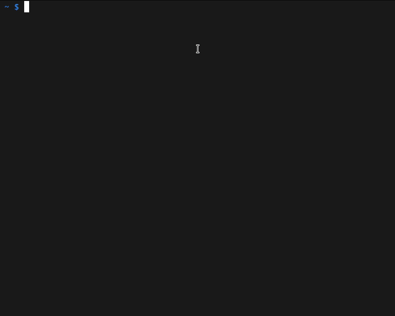

# Rook Remover


For when [Rook](https://rook.io/) absolutely, positively, must be uninstalled.

> **_WARNING:_** This software will cause data loss!
> If it doesn't, we are terribly sorry about the lack of irreversible destruction. Would you be so kind as to file a bug?

## Real-time Demo



## Downloading Dangerous Shellcode From the Internet And Executing It

```bash
\curl -sSL https://raw.githubusercontent.com/jhoblitt/rook-remover/master/rook-remover | bash -s
```

## Installation

```bash
mkdir -p ~/bin
\curl -sSL https://raw.githubusercontent.com/jhoblitt/rook-remover/master/rook-remover -o ~/bin/rook-remover
chmod a+x ~/bin/rook-remover
```
